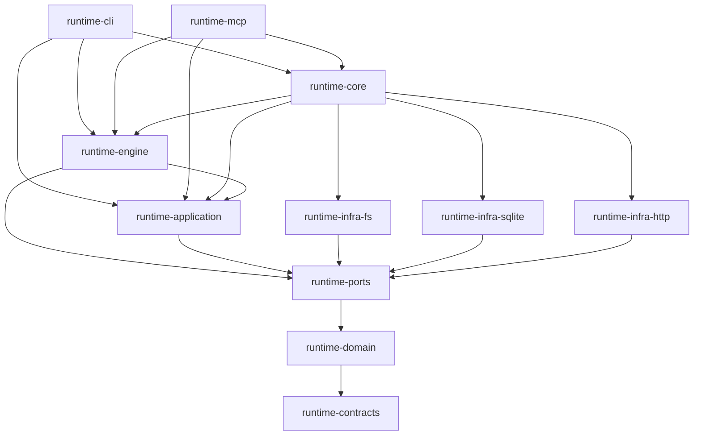

# Runtime Kotlin architecture investigation

## Assessment

The runtime has a credible hexagonal module structure. The dependency graph is not the main problem. The weaker design is inside that graph, where process lifetime is incompletely owned, database readiness is repeated on routine writes, projection failures disappear, and the feature run loop shares its state across many helpers.

I would keep the eleven modules. I would not approve a new framework, more interfaces per operation, or a repository-wide value-class conversion as the response to these findings. The useful work is to make ownership explicit and remove duplicate paths. The preparation produced four executable subtasks for those changes and retains SKILL-238 as the owner of its existing deletion work.

This is a module-wide architectural investigation with selected deep traces, not a claim to have manually read every line or certified every execution path. The inventory covers all production Kotlin files in the declared modules. The test run and probes below provide narrower executable evidence.

## Evaluation standard

The comparison to Reddit uses public engineering examples, not an invented company-wide checklist. Reddit's iOS feed write-up separates networking and pagination from controllers, keeps the view hierarchy flat, and ties design choices to scrolling and crash behavior. Those are useful standards here: assign a concrete responsibility to a component and verify the behavior it protects. [Building the Feed for the Reddit iOS App](https://redditinc.com/news/building-the-feed-for-the-reddit-ios-app).

The r/place write-up begins with load, consistency, isolation, and operating requirements and reuses technology Reddit already had. Applied here, that argues for the existing SQLite, JVM process, DI, and diagnostic infrastructure, with measured work and tested recovery. It does not justify importing Reddit's scale or service topology into a local runtime. [How We Built r/Place](https://redditinc.com/blog/how-we-built-rplace).

Clean Architecture's dependency rule supports the current inward graph, but its treatment of boundary data also exposes the cost of carrying serialized workflow state through inner logic. Cockburn's ports describe purposeful conversations with outside systems, which supports keeping real storage and launcher ports while questioning interfaces that only expose another object's collaborators. [The Clean Architecture](https://blog.cleancoder.com/uncle-bob/2012/08/13/the-clean-architecture.html), [Hexagonal architecture](https://alistair.cockburn.us/hexagonal-architecture).

YAGNI rejects speculative capability, not the recovery and validation this runtime already needs. Deleting a wrapper is justified when its call path adds no policy or needed substitution. Removing lease fencing or schema validation would discard current requirements. [Yagni](https://martinfowler.com/bliki/Yagni.html).

## Scope and provenance

- Audited on 2026-09-12 in the shared working tree.
- Production inventory excludes generated build output, fixtures, and tests. It includes all eleven modules declared in settings.gradle.kts. The residual runtime-desktop directory has no production Kotlin and is not a declared module.
- The working tree was already dirty. Another process made edits and commits during the investigation, including validation-gate work under 347. No existing source, test, commit, or branch was changed by this investigation. Counts are timestamped observations, not claims about one immutable Git tree.
- [evidence/inventory.json](evidence/inventory.json) records the final inventory, current HEAD, working-tree status, and hashes of the main evidence files. Source anchors below refer to the inspected code; use the hashes when the working tree has moved.
- The diff-oriented bill-code-review runtime was not invoked because this request covers the whole module rather than a named diff. This is a direct architectural investigation, not a driver-issued review approval. No native review workers or agent runs were launched.
- Validation used selected existing tests rather than bill-code-check's repair workflow because the authorized output is an investigation and spec. No full quality-gate pass, source repair, or installation is claimed. Local spec mode resolved through `skill-bill config resolve-spec-type --arg default`.

## Module coverage

| Module | Production files | Production lines | Test-source files |
| --- | ---: | ---: | ---: |
| runtime-application | 170 | 16,159 | 64 |
| runtime-cli | 112 | 11,411 | 60 |
| runtime-contracts | 54 | 3,000 | 6 |
| runtime-core | 20 | 982 | 76 |
| runtime-domain | 328 | 29,169 | 108 |
| runtime-engine | 287 | 40,088 | 125 |
| runtime-infra-fs | 397 | 40,594 | 199 |
| runtime-infra-http | 4 | 379 | 1 |
| runtime-infra-sqlite | 170 | 17,947 | 39 |
| runtime-mcp | 35 | 2,925 | 20 |
| runtime-ports | 225 | 7,493 | 5 |

Source inventories show 1,802 production Kotlin files, approximately 170,000 lines, and 703 test-source files. Counts include blank lines and comments. The two largest modules, runtime-engine and runtime-infra-fs, contain approximately 47% of production lines. Size alone is not a finding.

| Boundary | What was inspected | Assessment |
| --- | --- | --- |
| CLI/MCP to application/engine | Gradle edges, runtime component API, MCP workflow handlers and service composition | Transport mapping is outside the use cases. Entry modules explicitly depend on engine APIs; older prose omits that edge. |
| Application to persistence | LearningService, DatabaseSessionFactory, UnitOfWork | Learning validation and its related writes have a clear transaction owner. UnitOfWork is broad, but replacing it with many narrow transaction wrappers would need a specific consumer benefit. |
| Install and scaffold | InstallService, policy/facts ports, install/scaffold forwarding services, ownership guards | Planning policy and filesystem operations have distinct owners. Several forwarding services add little and are already in SKILL-238. |
| Feature and goal execution | RunLoop, RunState, drive/checkpoint/reentry/output settlement, GoalRunner and worker coordinator | Durable leases and injected supervision are warranted. Run-loop helper access remains too broad. |
| SQLite and file projection | Session acquisition, maintenance, manifest persistence and projection callbacks | Database transaction boundaries are real. Repeated maintenance and erased projection outcomes need fixes. |
| Process adapter | Spawn, wait, drain, output callbacks, endpoint teardown and probes | Strategy injection is sound; exceptional lifetime ownership is incomplete and reproduced. |
| HTTP and telemetry | HttpTelemetryClient, transport/config injection, existing SKILL-236 | HTTP remains outside the engine. Local fallbacks deserve explicit diagnostics, but delivery deduplication remains owned by SKILL-236. No remote telemetry or live data was queried. |
| Domain and contracts | WorkflowEngine, decomposition codec, model signatures, validators and key ownership | IO-library imports are constrained. JSON strings and raw maps still couple workflow rules to persisted shape through contract helpers. This is not a stdlib-only domain. |
| Build and enforcement | All module build files, convention ownership, selected architecture tests and baselines | Useful dependency checks coexist with vocabulary blind spots and stale prose. |

## Dependency graph

This diagram shows declared production project-dependency direction, not runtime call direction. Core composes both services and adapters. Actual api versus implementation exposure is tested separately.



Additional direct domain/contracts dependencies are omitted from the picture for readability. [evidence/inventory.json](evidence/inventory.json) records every declared project edge.

## Findings

### F-001. Process cleanup does not cover callback failure

Priority P1. Reproduced.

[JvmAgentRunProcessRunner.kt:88](../../runtime-kotlin/runtime-infra-fs/src/main/kotlin/skillbill/infrastructure/fs/launcher/process/JvmAgentRunProcessRunner.kt#L88) registers the child, starts drains, then waits. It catches InterruptedException around the wait, but other exceptions bypass finishRun. The outer finally closes only the review endpoint. [JvmAgentRunProcessWaitLoopProbes.kt:58](../../runtime-kotlin/runtime-infra-fs/src/main/kotlin/skillbill/infrastructure/fs/launcher/process/JvmAgentRunProcessWaitLoopProbes.kt#L58) calls the output sink directly.

A temporary child ran `exec sleep 20`. An injected progress probe caused an output callback, whose sink threw IllegalStateException. The runner threw and the child remained alive. The audit probe explicitly killed that child afterward.

```text
runner_exception=audit-output-sink-failure
child_alive_after_runner_exception=true
```

This lets work continue after its caller has failed. The global shutdown hook eventually reaps tracked processes only when the JVM exits. Give each invocation one immediate lifetime owner and run cleanup for every exit.

Related lifetime gap, inspected but not separately reproduced: [JvmAgentRunProcessOutputDrain.kt:120](../../runtime-kotlin/runtime-infra-fs/src/main/kotlin/skillbill/infrastructure/fs/launcher/process/JvmAgentRunProcessOutputDrain.kt#L120) joins with a deadline and then allows byte/digest reads without proving the worker stopped. F-001's implementation must cover incomplete drain settlement rather than merely wrapping waitForProcess in another catch.

### F-002. Every database write reacquires schema readiness through maintenance

Priority P2. Work amplification reproduced; production latency impact unmeasured.

[SQLiteDatabaseSessionFactory.kt:53](../../runtime-kotlin/runtime-infra-sqlite/src/main/kotlin/skillbill/infrastructure/sqlite/SQLiteDatabaseSessionFactory.kt#L53) opens through DatabaseRuntime.openDbAt for both write APIs. [DatabaseRuntime.kt:92](../../runtime-kotlin/runtime-infra-sqlite/src/main/kotlin/skillbill/infrastructure/sqlite/core/DatabaseRuntime.kt#L92) creates base schema and runs migration/repair functions on each open. Activity stamps and worker operations use these write APIs.

A recording JDBC driver initialized a temporary database, cleared its observations, then opened it again without adding any data. The second open executed:

```text
second_open_executed_statements=250
second_open_update_statements=10
second_open_begin_immediate=2
```

The updates include review execution-mode backfill, session timestamp backfill, and workflow metadata repair. They need not change a row to consume work or acquire write locks. This couples ordinary operation cost to historical compatibility logic and data size.

Separate schema readiness from connection acquisition within the existing database lifecycle. Preserve repair for legacy, failed-initialization, and replaced-database cases. A process-global Boolean keyed only by pathname is insufficient. This finding does not justify a connection pool or ORM.

### F-003. File projection failure is indistinguishable from no projection

Priority P2. Confirmed call path; fault injection belongs to implementation validation.

[DecompositionManifestWriter.kt:62](../../runtime-kotlin/runtime-application/src/main/kotlin/skillbill/application/decomposition/DecompositionManifestWriter.kt#L62) and its private writeProjection function both catch IOException and return null. [WorkflowGoalRunnerManifestWriteOpsImpl.kt:25](../../runtime-kotlin/runtime-infra-sqlite/src/main/kotlin/skillbill/infrastructure/sqlite/goalrunner/WorkflowGoalRunnerManifestWriteOpsImpl.kt#L25) saves the database and then requests the file projection. [WorkflowGoalRunnerManifestStoreContext.kt:54](../../runtime-kotlin/runtime-infra-sqlite/src/main/kotlin/skillbill/infrastructure/sqlite/goalrunner/WorkflowGoalRunnerManifestStoreContext.kt#L54) discards the writer result.

A disk or permission failure can therefore leave a stale manifest while the caller observes the normal database result and no projection failure record. Database-authoritative continuation is a sound choice; hiding divergence is not. Return explicit projection outcomes, report failure, and regenerate only the projection from durable state. Do not move the file write inside a SQLite transaction and call that cross-store atomicity.

The store also calls an engine-owned planning hydrator through a port. That callback preserves the transaction's preparation snapshot. Its existence alone is not a dependency inversion violation. Splitting it would require preserving the same atomicity, so no extra port or module move is prescribed.

### F-004. The run loop is shared state behind many helper objects

Priority P2. Structural evidence; no claim that all current transitions are wrong.

[FeatureTaskRuntimeRunLoop.kt:93](../../runtime-kotlin/runtime-engine/src/main/kotlin/skillbill/engine/featuretask/FeatureTaskRuntimeRunLoop.kt#L93) exposes the recorder, phase gates, diagnostics, request, and state to helper objects. The twenty FeatureTaskRuntimeRunLoop-prefixed files total 9,779 lines and contain 280 parameters typed as the whole run loop.

[FeatureTaskRuntimeRunLoopSession:201](../../runtime-kotlin/runtime-engine/src/main/kotlin/skillbill/engine/featuretask/FeatureTaskRuntimeRunLoop.kt#L201) keeps blocked, paused, and decomposed reports independently nullable. report() imposes precedence when more than one is present. BackwardEdge, Drive, PlanningBranch, Checkpoint, and OutputVerification assign session fields. RunState also exposes mutable collections despite offering named transition methods. Current callers mostly use those methods; the public mutation capability remains unnecessary.

The cost is that a change to checkpoint or reentry behavior requires understanding distant assignments and report precedence. Privatize coupled state, return explicit decisions, and pass helpers the values or capabilities they actually use. Do not replace 280 whole-loop parameters with 280 equivalent context bags.

The engine's only recorded package cycle is `featuretask|goalrunner`. Its reverse edge is the recovery-command formatting import in RunLoop, not a fundamental orchestration dependency. Move that formatting to an appropriate existing inward owner and remove the baseline entry.

### F-005. Same-module role interfaces repeat dependency properties

Priority P2. Existing remediation owner SKILL-238.

The phase-gate, review-runner, goal-planning-sweep, and goal-runner role files declare nine interfaces with 71 collaborator properties. Their Default implementations repeat the property declarations and add no behavior. Representative sources are [FeatureTaskRuntimePhaseGateRolePorts.kt](../../runtime-kotlin/runtime-engine/src/main/kotlin/skillbill/engine/featuretask/model/FeatureTaskRuntimePhaseGateRolePorts.kt), [its bindings](../../runtime-kotlin/runtime-engine/src/main/kotlin/skillbill/engine/featuretask/model/FeatureTaskRuntimePhaseGateRolePortBindings.kt), and [GoalRunnerRolePorts.kt](../../runtime-kotlin/runtime-engine/src/main/kotlin/skillbill/engine/goalrunner/model/GoalRunnerRolePorts.kt).

Keep the real injected ports in their fields. Collapse the extra role-interface layer to concrete composition data where useful, or inject the actual collaborator directly. Do not remove GoalRunnerManifestStore's capability slices merely because SQLite is its only production implementation.

UninstallFileSystemService adds six pure forwarding methods. SkillRemoveService constructs and forwards to SkillRemove. InstallAgentService also translates several request/result types and chooses agent identifiers, so its deletion needs a caller-level check rather than assuming every line is a pure forwarder.

The repo-scope over-engineering register for confirmed candidates is:

```text
runtime-kotlin/runtime-engine/src/main/kotlin/skillbill/engine/featuretask/model/FeatureTaskRuntimePhaseGateRolePorts.kt:L22: yagni: duplicate role interface properties. Keep one concrete injected composition type.
runtime-kotlin/runtime-application/src/main/kotlin/skillbill/application/review/model/ParallelCodeReviewRunnerRolePorts.kt:L24: yagni: duplicate planning and launch interface properties. Keep their concrete composition types.
runtime-kotlin/runtime-engine/src/main/kotlin/skillbill/engine/goalrunner/planning/model/GoalPlanningSweepRolePorts.kt:L17: yagni: duplicate checkpoint and launch interface properties. Keep their concrete composition types.
runtime-kotlin/runtime-engine/src/main/kotlin/skillbill/engine/goalrunner/model/GoalRunnerRolePorts.kt:L18: yagni: duplicate run, launch and finalization interface properties. Keep their concrete composition types.
runtime-kotlin/runtime-application/src/main/kotlin/skillbill/application/system/UninstallFileSystemService.kt:L8: delete: forwarding service. Call the already governed UninstallPathsPort from its adapter callers.
runtime-kotlin/runtime-application/src/main/kotlin/skillbill/application/scaffold/SkillRemoveService.kt:L9: shrink: forwarding facade. Compose and call SkillRemove directly where it preserves the existing boundary.
runtime-kotlin/runtime-infra-sqlite/src/main/kotlin/skillbill/infrastructure/sqlite/core/ConnectionTransactions.kt:L6-L22: delete: unused inTransaction extension. Nothing replaces it; live immediate-transaction helpers remain.
net: -90 lines possible, -0 deps possible.
```

The line estimate is conservative, not a measured patch. It allows for caller rewrites and excludes speculative savings from the run-loop refactor. Full source paths are in the inventory. The first six candidates remain SKILL-238's work; SKILL-239 does not duplicate them. The unused transaction helper can go with subtask 2 after another caller check.

### F-006. Wire enforcement cannot see keys with no owner

Priority P2. Scanner behavior reproduced.

[WireVocabularyArchitectureSupport.kt:46](../../runtime-kotlin/runtime-core/src/test/kotlin/skillbill/architecture/WireVocabularyArchitectureSupport.kt#L46) builds keyValues only from existing Keys objects. payloadKeyAccesses iterates that set. A new literal that lacks any owning declaration is therefore invisible.

The actual scanner, called with payload-key checks enabled, accepted this synthetic governed-payload candidate:

```kotlin
fun read(payload: Map<String, Any?>) = payload["unowned_contract_key"]
```

```text
unowned_payload_key_violations=[]
```

Actual decomposition codecs still access keys such as current_subtask_intent as literals. The green scanner proves compliance only with the vocabulary it has already discovered, not the stronger AGENTS.md rule. Use independent canonical contract coverage and a scoped check for literals at governed serialization seams. Do not reject arbitrary extension data or invent a universal Kotlin analyzer for this task.

### F-007. Written architecture and some tests preserve stale statements

Priority P3. Confirmed mismatch.

The current [code principles](../../docs/code-principles.md) and AGENTS.md state a 500-line ceiling; [PrincipleEnforcementInventory.kt:268](../../runtime-kotlin/runtime-core/src/test/kotlin/skillbill/architecture/PrincipleEnforcementInventory.kt#L268) enforces 1,200. The principles also describe empty baselines, while the inspected tree has one engine cycle and ambient-environment baselines of 104 filesystem, 12 SQLite, and four HTTP entries. Existing allowances are not automatically new defects, but the prose must not claim they are absent.

The documentation tests include incidental phrase bans such as [RuntimeArchitectureDocumentationTest.kt:67](../../runtime-kotlin/runtime-core/src/test/kotlin/skillbill/architecture/RuntimeArchitectureDocumentationTest.kt#L67). They pass while the numeric rule is wrong. Keep checks for contract sections and module ownership, remove editorial word bans, and verify duplicated numeric facts against their real owner.

The archived SKILL-233 spec also promised identifier wrappers and a stdlib-only domain. The tree has one value class, FileLocation, and runtime-domain still declares a serialization dependency. No direct serialization imports were found in domain production sources, but WorkflowEngine delegates JSON work through contract helpers. Archive status is not proof of the stronger design claim.

## SOLID and design judgment

| Principle | Current assessment | Decision |
| --- | --- | --- |
| Single responsibility | Good separation of entry adapters and use cases; weaker ownership in the run loop and database open path. | Fix F-002 and F-004. A short file is not evidence of one responsibility. |
| Open/closed | Manifest-driven packs and injected process strategies support actual extension requirements. | Keep these contracts. Do not replace open pack vocabulary with closed enums. |
| Liskov substitution | Port signatures and fixtures support substitution, but no universal behavioral audit of every implementation was performed. | Preserve success/failure and transaction semantics when changing adapters. No blanket LSP compliance claim. |
| Interface segregation | Goal store capability slices describe operations. Role interfaces that expose collaborators provide much less isolation. | Keep operation ports; remove redundant role layers under SKILL-238. |
| Dependency inversion | Declared module edges point inward. Both entry adapters share services, and composition knows concrete implementations. | Keep the graph. Fix lifecycle ownership rather than adding another abstraction layer. |
| Clean boundary data | Some typed models coexist with many maps and JSON-bearing workflow records. | Type the state changed by this feature. Do not authorize wholesale model migration from counts alone. |
| YAGNI | Recovery, schema guards and ports meet current needs. Property-only role layers and dead helpers are removable. | Delete demonstrated duplication. Keep required failure contracts and compatibility behavior. |

## Test-value assessment

Overall verdict: Mixed. Scope is the inspected architecture tests, process-runner tests, SQLite session tests, and implementation-attempt atomicity tests. This is not a suite-wide test-value verdict.

| Test or area | Verdict | Confidence | Evidence and action |
| --- | --- | --- | --- |
| SQLite transaction rollback after a use-case failure | Valuable | High | SQLiteDatabaseSessionFactoryTest writes a real row and verifies absence after failure. Keep. |
| Implementation attempt and phase advance agree | Valuable | High | FeatureTaskRuntimeImplementationAttemptAtomicityTest checks the durable boundary under injected failure. Keep; its in-memory failure is not a physical process-kill test. |
| Module edges and implementation imports | Valuable | High | The selected tests reject upward dependencies and concrete adapter imports. Keep. |
| Wire key ownership | Weak for its stated scope | High | Existing duplicate/foreign-key fixtures are useful; undeclared keys are untested and accepted. Extend the existing scanner with the independently established failing case. |
| Documentation English-phrase bans | Useless | High | A phrase such as 'while the' names no runtime or governance failure. Delete those assertions, not the contract-section checks. |
| Synthetic logical-type scanner test | Weak | Medium | The test reconstructs aggregation from helper functions rather than invoking the same full scanner path. Use one temporary source fixture through that path if retaining the claimed coverage. |
| Process lifetime after output-sink failure | Missing | High | Real probe leaves the child alive. Add a regression with guaranteed probe cleanup. |

Keep the transaction, durable-state, schema, and dependency checks. Rewrite only the wire and logical-type scanner fixtures where the existing critical guard can be exercised directly. Delete the incidental phrase assertion at RuntimeArchitectureDocumentationTest line 67. Keep the explicit forbidden compatibility-umbrella claim at line 66 and the other governed-document constraints unless their owning contract changes. Missing high-value cases are process callback cleanup, incomplete drain settlement, repeated write maintenance, database readiness invalidation, and projection failure after commit.

## Validation and limits

The focused command is preserved in [evidence/validation.md](evidence/validation.md). It ran seven existing test classes, 36 tests, with zero failures or errors. The process, JDBC, and scanner probes ran against the compiled classes and are preserved under evidence with their outputs. They used temporary children and a temporary database; they did not read the user's runtime database.

No full `check`, production-scale benchmark, external API compatibility exercise, security penetration test, or production failure-rate analysis ran. The generated spec and subtasks are schema/format checked separately. Existing source changes remain outside this delivery.

## Changes deliberately not proposed

- No microservice split or new runtime module. There is no measured deployment or ownership requirement for one.
- No automatic removal of single-implementation storage, launcher, or validator ports. They cross real module boundaries and have useful substitutes.
- No universal value-class or DTO migration. String/Map counts are search evidence, not proof of a user-visible bug.
- No deletion of migration repair, lease fencing, quarantined evidence, schema parity, or current extension maps to reduce line counts.
- No attribution of this code to Reddit's internal standards. The public examples informed the evaluation; the findings stand on repository evidence.
