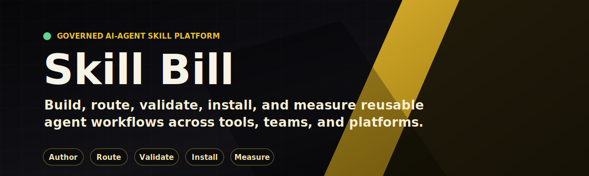
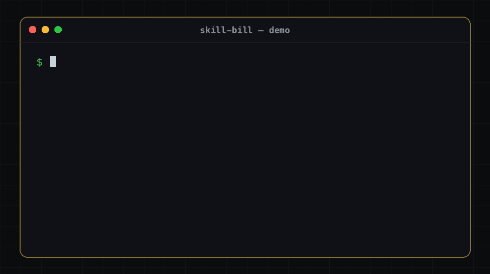

# Skill Bill

[](LICENSE)


**Hand Skill Bill a spec and get back a merge-ready PR — planned, implemented, stack-specialist-reviewed, audited against the spec, and quality-gated.** AI coding agents are powerful but inconsistent: the same prompt yields different work every run, with no process holding it together. Skill Bill gives yours the structure of a real engineering process and runs it the same way every time, across whichever agents you use.



> A `/bill-feature` run carrying a spec through every phase to a merge-ready PR — and because the run is interrupted mid-flight (usage limit, crash, lost connection) it also shows the part most demos hide: it resumes from durable workflow state and finishes, nothing lost. The demo is generated, not hand-recorded ([`docs/assets/generate_demo_gif.py`](docs/assets/generate_demo_gif.py)), so it never goes stale.

**Built with itself.** Skill Bill's own features ship through this pipeline. [#177](https://github.com/oila-gmbh/skill-bill/pull/177) was planned, implemented, reviewed, and written up by the same process described here — click through and judge the actual output, not a demo.

**Who it's for:** developers and teams who want their AI agent to implement whole features with the rigor of a real engineering process — planned, reviewed, audited, and quality-gated — instead of one-off code they have to babysit and re-review. That explicitly includes developers raw agents *didn't* work for: if you tried an agent, got inconsistent results, and went back to using AI as a Q&A tool, the missing piece was process, not the model — and packaged process is what this is. Our earliest users split exactly two ways: developers who did no AI-driven feature work before Skill Bill, and heavy agent users who keep choosing it over their own hand-rolled workflows. You still review the final PR; the point is that what reaches you was already planned, reviewed, and checked, not dumped on you raw. Probably overkill if you only want quick single-file completions. Pre-1.0, built and maintained by a small team.

## Quickstart (≈60 seconds)

```bash
curl -fsSL https://raw.githubusercontent.com/oila-gmbh/skill-bill/main/install.sh | bash
```

Downloads and checksum-verifies the prebuilt runtime for your OS — no clone, no JDK, no Gradle. Needs only `curl`, `tar`, `unzip`, and either `shasum` or `sha256sum` on `macos-arm64`, `macos-x64`, `windows-x64`, or `linux-x64`.

Don't pipe a stranger's script straight into your shell? Read it first:

```bash
curl -fsSL https://raw.githubusercontent.com/oila-gmbh/skill-bill/main/install.sh -o install.sh
less install.sh   # it's a plain shell script — read it
bash install.sh
```

```bash
skill-bill version
skill-bill doctor
skill-bill update-check
skill-bill update
```

> If `skill-bill` is **not found**, the launcher directory (`~/.local/bin` by default) isn't on your `PATH`. Add it — `export PATH="$HOME/.local/bin:$PATH"` — and put that line in your shell's rc file (`~/.bashrc`, `~/.zshrc`, `~/.config/fish/config.fish`).

**Contributors or unsupported hosts:** clone the repo and run `./install.sh --from-source` (requires a JDK). Any host not in the four prebuilt targets falls back to this automatically.

## Why it exists

AI coding agents don't follow a consistent process. The same prompt produces different work each run — sometimes it reviews thoroughly, sometimes it skims; sometimes it follows your conventions, sometimes it invents new ones; sometimes it finishes the feature, sometimes it wanders off. That is fine for a quick completion and a real problem for shipping a feature you have to stand behind.

Dropping skill files into `~/.claude/skills/` doesn't fix that — they're just prompts the agent can follow or skip, with nothing checking. Skill Bill runs a curated skill set as a structured, enforced process instead: a durable runtime that owns each feature run, a fleet of specialist subagents, contracts that fail loudly when skills drift, and the same skill set working across every agent. The skills carry the engineering judgment; the runtime makes the agent actually follow it on every run.

## What you get

**A feature implemented end-to-end from a spec** — planning, implementation, stack-specialist review, completeness audit, and quality gates, all the way to a merge-ready PR. That is the headline. Everything else exists to make it reliable, repeatable, and yours:

- the same governed skill set installed across every agent you use — verified end-to-end on Claude Code and Codex
- a governed contract that fails loudly when skills drift instead of silently going stale
- durable, resumable workflow state so long-running multi-phase skills survive crashes and context compaction — and resume is agent-independent: a run paused under Claude Code continues under Codex with the same command
- automatic decomposition of oversized work into resumable subtasks the runtime tracks for you — each subtask runs in a fresh context briefed from curated durable artifacts, so long goals don't degrade no matter how many hours they run
- structured telemetry through a pluggable proxy you can self-host
- per-project overrides so the same skill behaves differently per repo without forking
- per-module memory so institutional knowledge lives next to the code
- a Compose Desktop UI for authoring, validation, scaffolding, and install — no CLI required

[Capability deep-dive →](docs/capabilities.md)

## Reference pack

Skill Bill ships complete Go, iOS, Kotlin/KMP, PHP, Python, Rust, and TypeScript packs — the stack-specific intelligence that lets the system review and check your code like someone who actually knows that stack. Use them directly if they fit, tune them to your conventions, or add a pack for your stack.

**Daily entry points:**

- `/bill-feature` prepares the feature spec, then routes to implementation or the goal loop
- `/bill-feature-spec` prepares governed single-spec or decomposed feature-spec artifacts before implementation
- `/bill-code-review` routes to the matching platform review stack (the stack-specific review skills are internal sidecars, not separately invocable)
- `/bill-code-check` routes to the matching stack-specific checker (the stack-specific checker skills are internal sidecars, not separately invocable)
- `/bill-pr-description` generates PR text and QA steps
- `/bill-feature-verify` verifies a PR against a spec or design doc

**Shipped platform packs:**

Go, iOS, Kotlin, PHP, Python, Rust, and TypeScript each own all ten approved review areas. KMP composes the seven Kotlin baseline areas it does not replace with KMP-owned platform-correctness, UI, and UX-accessibility lanes. Every pack routes quality checks directly to its own manifest-declared checker, including KMP through `bill-kmp-code-check`.

- `kotlin` — baseline Kotlin review and quality-check behavior
- `kmp` — Kotlin review baseline plus KMP platform, UI, and accessibility depth, governed add-ons, and direct multiplatform quality-check behavior
- `ios` — native iOS review and quality-check behavior via `bill-ios-code-review` and `bill-ios-code-check`, routed from `.xcodeproj`, `.xcworkspace`, SwiftUI/UIKit, lifecycle, concurrency, UI, and accessibility signals
- `go` — Go services, libraries, CLIs, modules, APIs, persistence, concurrency, security, testing, Go-rendered UI, UX/accessibility, and quality-check behavior
- `php` — PHP applications, services, Composer projects, APIs, persistence, security, testing, server-rendered UI, UX/accessibility, and quality-check behavior
- `python` — Python applications, libraries, CLIs, APIs, persistence, security, testing, UI, UX/accessibility, and quality-check behavior
- `rust` — Rust crates and workspaces, services, CLIs, async runtimes, FFI, persistence, safety, testing, UI/UX, and Cargo-aware quality-check behavior
- `typescript` — TypeScript applications, libraries, services, Node/browser runtimes, APIs, persistence, async behavior, TSX UI/UX, and package-manager-aware quality checks

Maintained packs share one exemption-free substance gate: every effective specialist needs at least three platform-specific failure-mode clusters and ten evidence-bearing rules, forbidden generic placeholders are rejected, shared normalized five-word sequences are capped at 35%, and corresponding authored rubrics are capped at 65% similarity. Discovery remains manifest-driven; the current pack list is not hard-coded into the gate.

**Full skill catalog:**

| Skill | Purpose |
|-------|---------|
| `/bill-boundary-decisions` | Record architectural and implementation decisions in `agent/decisions.md` |
| `/bill-boundary-history` | Record reusable feature history in `agent/history.md` |
| `/bill-code-check` | Stable quality-check entry point that routes to the matching platform checker (stack-specific checker skills install as internal sidecars, not listed commands) |
| `/bill-code-review` | Stable code-review entry point that routes to the matching platform pack (stack-specific review skills install as internal sidecars, not listed commands) |
| `/bill-code-review-parallel` | Run two review agents in parallel on the same diff and merge their findings |
| `/bill-feature` | Primary feature entry point that prepares a spec, then routes to implementation or the goal loop (dispatches internally to the feature-execution family, which is not listed) |
| `/bill-feature-guard` | Add feature-flag rollout safety to an implementation |
| `/bill-feature-guard-cleanup` | Remove feature flags and legacy code after rollout |
| `/bill-feature-spec` | Standalone feature-spec preparation (single-spec or decomposed) reused by feature and goal workflows |
| `/bill-feature-verify` | Verify a PR against a task spec or design doc |
| `/bill-pr-description` | Generate a PR title, description, and QA steps |
| `/bill-pr-review-fix` | Resolve PR review comments end-to-end with an approval gate and reply automation |
| `/bill-unit-test-value-check` | Review unit tests for low-value or tautological coverage |
| `/bill-release` | Cut a Skill Bill release: generate a curated changelog, confirm the semver bump, create and push the annotated tag |
| `/bill-update-check` | Check the installed Skill Bill version against GitHub releases |

## Learn more

- [Getting Started](docs/getting-started.md): install flow, CLI surfaces, agent support tiers, and MCP tool groups
- [Getting Started for Teams](docs/getting-started-for-teams.md): rollout guidance, customization strategy, and adoption patterns
- [Skill Bill Teams Roadmap](docs/team-control-plane-roadmap.md): staged path from team bundle sync to admin editing, telemetry-driven tuning, and hosted org controls
- [Capability Deep-dive](docs/capabilities.md): the full system — one-shot install, durable workflows, platform packs, decomposition, Desktop UI, telemetry, overrides, memory, and governance
- [Skill Source And Generation Model](docs/skill-source-generation.md): `content.md` vs generated `SKILL.md`, support pointers, install staging, and native-agent generation
- [External Addon Sources](docs/external-addons.md): overlay private or team-specific review add-ons onto an installed pack, kept out of the shared repo
- [Review Telemetry](docs/review-telemetry.md): telemetry contract, learnings, local DB usage, and remote proxy stats

## License

The governing text is the [Skill Bill Use License 1.0](LICENSE)
(`LicenseRef-Skill-Bill-Use-1.0`). The concise, non-authoritative
version matrix is in [Licensing](docs/licensing.md): v0.1.0 and v0.1.1 retain
their shipped terms; releases from v0.1.2 allow lawful use, including commercial
use, before the stable `v1.0.0` Stable Release Event. At and after that event,
personal use and
qualifying open-source-project use remain free, while every other commercial use
requires a purchased Commercial License. Documented skills, packs, and other
customization materials may be modified for permitted use, but public
redistribution is not granted. User-authored materials and generated outputs
remain the user's, subject to protected Skill Bill material and third-party
rights.
