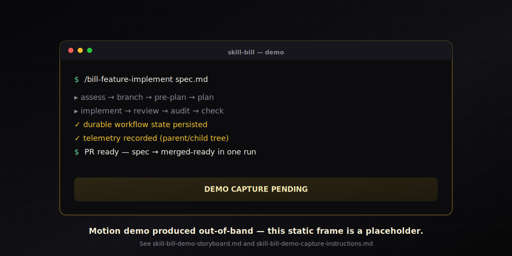

# Skill Bill

One source of truth for your AI coding skills — authored once, synced across Claude Code, Copilot, Codex, OpenCode, and Junie, with the validation and durable workflow state to keep them from rotting.



> The image above is a **static placeholder**. The motion demo (a real `/bill-feature-task` spec→PR run) is produced **out-of-band** and is **not yet committed** — the recorded binary is intentionally missing for now. See the [demo storyboard](docs/assets/skill-bill-demo-storyboard.md) for the shot list and the [capture instructions](docs/assets/skill-bill-demo-capture-instructions.md) for how it gets recorded and swapped in.

## Quickstart (≈60 seconds)

The default `./install.sh` path is **prebuilt**: it downloads and checksum-verifies the release runtime artifacts for your OS. No JDK, no Gradle build.

```bash
git clone https://github.com/Sermilion/skill-bill.git ~/Development/skill-bill
cd ~/Development/skill-bill
./install.sh
```

Then confirm it works and try a starter command:

```bash
skill-bill version
skill-bill doctor
```

That is the whole happy path. Everything below is optional depth.

## Prerequisites

Two install paths, two sets of prerequisites:

- **Prebuilt (default `./install.sh`)** — needs only `curl`, `tar`, `unzip`, and either `shasum` or `sha256sum`, plus a supported OS/arch: `macos-arm64`, `macos-x64`, `windows-x64`, or `linux-x64`. **No JDK required.** Any other host automatically falls back to the from-source path.
- **From source (`./install.sh --from-source`)** — builds the runtime with Gradle and **requires a JDK**. Use this when you want to build from your checkout, or when your host is not one of the four prebuilt targets (the installer also falls back here automatically).

## Deep under the hood, trivial to use

Skill Bill looks like a lot of machinery, and it is — but the path you actually run is one command: `./install.sh`. Everything documented below the fold (the capability deep-dive, architecture, contracts) is optional reading, not setup you have to perform.

**The product is the framework, not the prompts.** Skill Bill does not ship "the right way to do code review." It ships everything *around* the prompt that turns one author's prompt into something a 200-person engineering org can rely on. A working Kotlin/KMP reference pack is included so you can see a fully-wired example end-to-end — use it as-is, fork it, delete it, or replace it entirely. The reference packs are replaceable; you are expected to author your own packs for your own stack, conventions, and review style.

---

Skill Bill is the runtime, governance, and operations layer for AI-agent skills. You bring your own prompts; Skill Bill handles install across every coding agent your team uses, routing per platform, durable workflow state, decomposition of oversized work, structured telemetry through a self-hostable proxy, drift protection, project-level customization, and a desktop UI to manage all of it.

What Skill Bill gives you:

- one source of truth for every coding agent your team uses (Claude Code, Copilot, Codex, OpenCode, Junie)
- a governed contract that fails loudly when skills drift instead of silently going stale
- durable, resumable workflow state so long-running multi-phase skills survive crashes and context compaction
- automatic decomposition of oversized work into resumable subtasks the runtime tracks for you
- structured telemetry through a pluggable proxy you can self-host
- per-project overrides so the same skill behaves differently per repo without forking
- per-module memory so institutional knowledge lives next to the code
- a Compose Desktop UI for authoring, validation, scaffolding, and install — no CLI required

## Why it exists

Most prompt or skill repos degrade over time:

- names drift
- overlapping skills appear
- stack-specific behavior leaks into generic prompts
- different agents get different copies

Skill Bill treats skills more like software:

- stable base capabilities
- platform-specific overrides behind routers
- shared contracts instead of prompt folklore
- loud-fail validation instead of silent fallback
- one repo synced across multiple coding agents

## What you get

Skill Bill ships a stack of capabilities that compose. Most of them are invisible during normal use — that is the design — but each one is doing real work behind the slash commands.

### 1. One-shot multi-agent install via symlinks

`install.sh` symlinks every skill into each detected agent's directory (Claude Code, Copilot, Codex, OpenCode, Junie). A single source-of-truth `skills/` tree powers all of them, so an edit in one place reaches every agent immediately. The same mechanism handles uninstall and the runtime launcher binaries.

### 2. `bill-feature-task` — the end-to-end feature factory

One slash command that takes a spec or design doc and walks it all the way to a merged-ready PR, scaling ceremony to the size of the work. The pipeline: assessment → branch → pre-planning digest → planning (or decomposition) → implementation → code review → completeness audit → quality check → history/decisions → commit/push → PR description.

Cross-cutting properties:

- Every heavy phase runs in its own subagent with a self-contained briefing — orchestrator stays small, specialists go deep.
- Durable workflow state at every phase boundary — crash anywhere and resume cleanly.
- Phase-to-artifact mapping is explicit (`assessment`, `preplan_digest`, `plan`, `implementation_summary`, `review_result`, `audit_report`, `validation_result`, `history_result`, `commit_push_result`, `pr_result`) — every step produces a named, persistable output.
- Telemetry is mandatory and transport-resilient.
- Stack-aware via platform packs.
- Project-tunable via `.agents/skill-overrides.md`.
- Decomposes itself when too big.

It is a tiny CI/CD for the feature itself, not just the code.

### 3. Native platform overrides via platform packs

Generic skills like `/bill-code-review` and `/bill-code-check` are routing shells. The real work lives in `platform-packs/<lang>/` (today: `kotlin`, `kmp`), with native versions such as `bill-kotlin-code-review` plus area specialists (`-architecture`, `-security`, `-performance`, `-persistence`, `-api-contracts`, `-reliability`, `-platform-correctness`, `-testing`). KMP layers further on top of Kotlin with `-ui` and `-ux-accessibility` add-ons. At runtime the generic entry point reads `routing_signals` from each pack's `platform.yaml` (e.g. `.kt`, `build.gradle.kts`, plus KMP tie-breakers like `androidMain`/`expect/actual`) and hands off to the matching native skill. Adding a new language is purely additive — drop in `platform-packs/<lang>/` and `/bill-code-review` starts routing to it. No edits to the generic skill, no fork.

### 4. Manifest-driven task decomposition, auto-resume by issue key

When planning detects work is too big (rules of thumb: more than 15 atomic tasks, more than 6 boundaries, multiple independently resumable milestones, or sequencing with verify-able foundations), `bill-feature-task` switches into `mode: "decompose"` instead of implementing.

- **Subtask specs are real artifacts**: planning writes `.feature-specs/{ISSUE_KEY}-{feature-name}/spec_subtask_1_foundation.md`, `_2_runtime-wiring.md`, etc. — each with its own acceptance criteria, non-goals, dependency notes, validation strategy, and the exact `bill-feature-task` prompt to run for it later.
- **Schema-validated manifest**: a `decomposition-manifest.yaml` is generated and validated against `orchestration/contracts/decomposition-manifest-schema.yaml`, so the plan itself is a contract, not loose prose.
- **You only need the issue key**: when you come back and say "continue SKILL-51", the runtime resolves the parent manifest, finds the in-progress subtask at its last durable workflow step, and picks up there. If none is in-progress, it starts the first pending subtask whose dependencies are complete. You never have to remember "was I on subtask 2 step 4 or subtask 3 step 1."
- **Blocked-aware**: if the current path is blocked it stops and tells you why, instead of silently skipping to a later dependent subtask.
- **Branch strategy is declared, not improvised**: defaults to `same_branch_commit_per_subtask` (one commit per subtask on the parent feature branch); `stacked_branches` is an explicit opt-in where the runtime refuses to advance if the current branch/base does not match the manifest.
- **Decomposition is a successful outcome, not a failure**: the workflow closes as `abandoned_at_planning` with `plan_deviation_notes: decomposed into N subtasks` — logged as scope governance, not as a crash.

### 5. Full Compose Desktop UI hiding all of the above

`runtime-desktop` is a real native app on top of all of this, not just a CLI. Modular Compose Multiplatform build with kotlin-inject DI, KSP-generated components, and platform packaging targets.

What the UI gives the user without exposing the machinery:

- Tree-based skill/artifact browser — authored skills, generated artifacts, platform packs, all navigable in one view.
- First-run setup dialog and repo directory chooser.
- Scaffold wizard — deterministic `skill-bill new` prompts backed by the same payload contract used by automation; the tree selection jumps to the newly authored file on success.
- Validate-agent-configs runner — the manifest/drift validator wired as a button with a result panel.
- Confirm-deletion dialog — for deterministic `skill-bill remove`, with safety prompts built in.
- Command palette — keyboard-driven action surface for all operations.
- Keyboard accelerators and accessibility-friendly navigation.
- Repo file-change observer — external edits (e.g. from a coding agent) reflect in the tree without manual refresh.
- Packaging configuration that produces real installable artifacts.

All of the symlink installs, manifest validation, platform-pack routing, native-agent generation, telemetry, and workflow state happens underneath without ever leaking into the user's view.

### 6. Stateful, resumable workflows with native subagents

`bill-feature-task` is not a monolithic prompt; it is an orchestrator over durable state and a fleet of purpose-built subagents.

- **Durable state**: `feature_task_workflow_open` mints a `workflow_id`; every phase boundary writes via `feature_task_workflow_update` and gets back a compact acknowledgement, not a full snapshot. If a session dies mid-run, `feature_task_workflow_continue` is the mutating activation path: it re-opens the exact phase and returns a compact continuation payload (resume step, required/available artifact keys, compact current-step artifacts) as the continuation contract — full durable state is fetched only on demand through the read-only `workflow show`. The run survives crashes, compaction, even a host reboot. Same shape exists for `bill-feature-verify` (`feature_verify_workflow_*`).
- **Native subagents per phase**: pre-planning, planning, implementation, completeness-audit, quality-check, PR-description, and an implementation-fix loop each ship as their own installed agent.
- **Native subagents per review specialist**: every Kotlin/KMP review area is its own subagent too.
- **Why this matters for tokens**: each subagent gets a self-contained briefing scoped to its phase/area instead of inheriting the full orchestrator transcript. The orchestrator stays small; specialists go deep on their narrow slice. Better focus and lower cost — the opposite of the usual "more steps = more context bloat" trap.
- **Transport-resilient telemetry**: a packaged Kotlin `runtime-mcp` stdio fallback ensures a dropped MCP transport does not leave a workflow stuck in `running`.

For decomposed goals, the foreground `skill-bill goal` runtime owns a flat worker
model: it selects one runnable subtask, opens or resumes that child workflow,
launches one fresh child process, and advances only from durable workflow state.
Nested/native subagents inside the child session are useful for focus and
debugging, but the reliability contract is the runtime-owned workflow row plus
the decomposition projection.

Operator-facing observability stays local and bounded:

```bash
skill-bill goal SKILL-901
skill-bill goal status SKILL-901 --diff-stat
skill-bill goal watch SKILL-901 --interval-seconds 5 --max-refreshes 3
skill-bill goal status SKILL-901 --diff-hunk runtime-kotlin/runtime-cli/src/main/kotlin/skillbill/cli/GoalCliCommands.kt --diff-hunk-max-hunks 2 --diff-hunk-max-lines 20 --diff-hunk-max-bytes 4000
```

Typical output:

```text
goal_observability: issue_key=SKILL-901 subtask_id=1 workflow_phase=implement worker_role=foreground liveness_class=durable_progress sequence_number=1
latest_observability: phase=implement role=phase_subagent liveness=durable_progress sequence=8
diff_stat: files_changed=3 insertions=12 deletions=4
watch_diff_stat: index=2 files_changed=3 insertions=12 deletions=4
selected_diff_hunks: count=1 truncated=false
selected_diff_line: hunk_index=1 line_index=1 path=runtime-kotlin/runtime-cli/src/main/kotlin/skillbill/cli/GoalCliCommands.kt staged=false text=+new
```

### 7. `content.md` is the only authored surface; everything else is generated

A skill author touches exactly one file. Free-form markdown, frontmatter on top, prose body underneath, write it however you want. No JSON, no schema, no boilerplate.

Generated from it (and you never hand-edit):

- Per-agent skill files in each agent's native format (Claude, Copilot, Codex, OpenCode, Junie), installed as symlinks back to the one source `content.md` so any edit lands everywhere instantly.
- Native subagent files in each agent's required format, registered by name and briefed by the orchestrator at runtime.
- Pointer files inside platform packs — single-line markdown files regenerated from `platform.yaml` by the renderer (you are literally not supposed to commit them).
- Slash-command registration in each agent.
- Skill discovery descriptions derived from the frontmatter `description`.
- MCP tool exposure for workflow and telemetry, without the author wiring anything.

The author contract is: write the body, declare the description, the rest is the renderer's problem. The validator from #11 keeps the generated artifacts from drifting from the manifest. Soft inside, hard shell.

### 8. Per-project skill fine-tuning via `.agents/skill-overrides.md`

Every skill reads the project's override file as part of its shared ceremony, so you can change skill behavior for a specific repo without forking or editing the skill source. The file lives in the repo, is versioned with the code, and applies to whichever agent is running.

- **Orchestrator-owned read**: the override file is read by the orchestrator, not delegated to a subagent. (When delegated, action mandates used to get paraphrased into free-form notes and silently dropped — see `agent/decisions.md` for the incident that hardened this.)
- **Action mandates at named lifecycle positions**: overrides can declare mandates that fire at specific orchestrator lifecycle points (e.g. before applying the skill body, at end-of-run for state writes). Skills cannot quietly skip them.
- **Composable with `AGENTS.md`**: the shared ceremony loads both general project conventions and per-skill targeted tweaks.

Net effect: you fine-tune `bill-code-review` with an extra checklist item, or force `bill-feature-task` to call a project-specific telemetry tool, by editing one markdown file in the repo. No skill fork, no agent reinstall.

### 9. Per-module memory

Every module/package has its own `agent/decisions.md` and `agent/history.md`. The `/bill-boundary-decisions` and `/bill-boundary-history` skills know how to write high-signal entries with hygiene rules that keep history from rotting. Result: cross-session institutional knowledge attached to the code itself, not to your head or a wiki. You can see it in this very repo — `agent/decisions.md` records the exact incident that hardened the override read in #8. That is how the system stays self-aware across sessions and contributors.

### 10. First-class, transport-resilient structured telemetry

Every skill that matters emits typed telemetry, not just log lines.

- **Per-skill start/finish pairs** with stable session ids: `feature_task_started/_finished`, `feature_verify_started/_finished`, `quality_check_started/_finished`, `review_stats`, `pr_description_generated`, `import_review`, `triage_findings`, `resolve_learnings`, plus aggregate views (`feature_task_stats`, `feature_verify_stats`, `telemetry_remote_stats`, `telemetry_proxy_capabilities`).
- **Orchestrator/child relationship is modeled**: orchestrated subagents call their own `*_finished` with `orchestrated=true` and return a `telemetry_payload`; the orchestrator assembles a parent/child tree. You can see the whole run as a tree, not a flat stream.
- **Separated from workflow state, on purpose**: workflow state persists even when telemetry returns `status: skipped`. Telemetry is observability; workflow state is correctness. They never get confused.
- **Health-checked and transport-resilient**: before terminal writes the orchestrator pings the MCP transport; if closed, it switches to the packaged `runtime-mcp` stdio fallback for the remaining telemetry and workflow calls. Runs do not get left in a half-reported state because a transport died.
- **Aggregate stats tools** give you queryable rollups, so you can actually see how your feature-task pipeline is behaving instead of grepping logs.
- **Pluggable proxy target**: events flow through a telemetry proxy, with a hosted relay as the default. Point it at your own service by setting `proxy_url` in the telemetry config (or `TELEMETRY_PROXY_URL` in the environment) and `skill-bill telemetry sync` / `capabilities` / `stats` will operate against it. Self-host, anonymize, or fork the proxy itself — Skill Bill's telemetry pipeline doesn't lock you to anyone's backend.

### 11. Strict, declarative skill-set contract with drift protection

Every platform pack is anchored by a `platform.yaml` that declares: contract version, routing signals, the full set of declared code-review areas and their content-file paths, the declared quality-check file, and pointer files (auto-generated so no one hand-edits them). Backed by `scripts/validate_agent_configs`, which fails the build if the on-disk layout does not match the manifest (missing files, stray skills, broken pointers, agent-install inconsistencies). You cannot accidentally rename a skill, half-delete an area, or let one agent's copy diverge from another. Render/install regenerates pointers from the manifest, and validation refuses to let drift land.

This is the governance layer that keeps the other ten features from rotting — once you have seen what they enable, you also see why this one exists.

## Install details

The default `./install.sh` is the **prebuilt** path: it downloads and checksum-verifies the runtime images from the matching GitHub release, so no JDK and no Gradle build are needed. Pass `--from-source` to build from your checkout with Gradle instead (requires a JDK).

```bash
git clone https://github.com/Sermilion/skill-bill.git ~/Development/skill-bill
cd ~/Development/skill-bill
./install.sh
```

After install:

```bash
skill-bill version
skill-bill doctor
skill-bill validate
skill-bill install detect-agents
skill-bill telemetry status
```

The installer:

- installs `skill-bill` and `skill-bill-mcp` launchers into `${SKILL_BILL_BIN_DIR:-~/.local/bin}`
- detects supported agents
- renders selected skills into `~/.skill-bill/installed-skills/` and links agent skill entries to those staged outputs
- installs selected platform packs
- registers the local Skill Bill MCP server for agents that support MCP config

On the default prebuilt path the runtime images come from the matching GitHub release and are checksum-verified before they are installed — the installer does **not** build the Kotlin CLI/MCP distributions locally. On `--from-source` the installer instead builds the Kotlin CLI and MCP distributions with Gradle (JDK required). Either way it then copies the packaged runtime into `~/.skill-bill/runtime/`, verifies the installed bin scripts, installs the launchers, renders selected skills into staging, and links those staged skills into detected agent directories.

`./install.sh` is the terminal installer. It prompts for manual or detected
agents, optional platform packs, telemetry level (`anonymous`, `full`, or
`off`), and optional desktop app installation, then delegates the actual install to
`skill-bill install apply`. The reusable runtime path owns staging, symlinks,
native-agent output, telemetry configuration, MCP registration, and Windows
symlink preflight outcomes.

Install source and release flags:

- `--from-source` — build the runtime (and desktop app) from source with Gradle instead of fetching prebuilt artifacts. Requires a JDK. Ignores `--release` and is the automatic fallback when no prebuilt asset matches your host.
- `--release TAG` — install a specific release tag instead of the latest stable release (also settable via the `SKILL_BILL_RELEASE_TAG` environment variable). Ignored under `--from-source`.

Supported prebuilt host tokens are `macos-arm64`, `macos-x64`, `windows-x64`, and `linux-x64`; any other host auto-falls back to `--from-source`.

Supported install targets today:

- GitHub Copilot
- Claude Code (skills under `~/.claude/commands/`; native subagent markdown under `~/.claude/agents/`)
- OpenAI Codex (skills under `~/.codex/skills/`, with `~/.agents/skills/` compatibility fallback; native subagent TOMLs under `~/.codex/agents/`)
- OpenCode (skills under `~/.config/opencode/skills/`; native subagent markdown under `~/.config/opencode/agents/`)
- JetBrains Junie (skills under `~/.junie/skills/`; native subagent markdown under `~/.junie/agents/`; MCP config under `~/.junie/mcp/mcp.json`)

Using GLM as a model in Claude Code? Skill Bill installs to the Claude Code commands directory — no separate target needed. GLM is a model, not a harness.

Native subagent definitions are installed only for orchestrators that ship them. The source of truth is either provider-neutral markdown files under `native-agents/<name>.md` or bundled entries in `native-agents/agents.yaml`; new and rendered neutral sources carry `contract_version: "0.1"`, while the parser still accepts older unpinned sources for migration tolerance. Provider-specific Claude markdown, Codex TOML, OpenCode markdown, and Junie markdown are generated at install time into `~/.skill-bill/native-agents/` and linked into each runtime's agent directory. Skill Bill installs Codex native subagents to `~/.codex/agents/`; `~/.agents/agents/` is only a Skill Bill compatibility path for homes that do not have a `.codex` root. `skill-bill render` validates source files without committing generated provider artifacts, and `scripts/validate_agent_configs` fails if generated provider artifacts are checked into the repo. Today this covers the `bill-kmp-code-review` KMP specialists, the `bill-kotlin-code-review` Kotlin specialists, and the `bill-feature-task-legacy` workflow phases (pre-planning, planning, implementation, implementation-fix, completeness-audit, quality-check, pr-description). `bill-feature-verify` has no verify-specific native subagents; it delegates review through `bill-code-review` and keeps its verify audits inline. Parsing tolerance for `RESULT:` blocks across runtimes is documented inline in `skills/bill-feature-task-legacy/content.md`.

## Desktop App

Skill Bill also ships an optional Compose Desktop app from
`runtime-kotlin/runtime-desktop`. The app is repo-based and uses the same
runtime services as the CLI for authoring, validation, scaffold, install, and
pack discovery.

The terminal installer can also install the prebuilt desktop app for the current user:

```bash
./install.sh --with-desktop-app
```

This downloads + checksum-verifies the published desktop installer for your host and installs the app into a per-user location: `~/Applications` on macOS,
`${XDG_DATA_HOME:-~/.local/share}/skillbill/desktop` on Linux, and
`%LOCALAPPDATA%/SkillBill/Desktop` on Windows shells. It also adds a
`skillbill-desktop` launcher beside the normal `skill-bill` and
`skill-bill-mcp` launchers. Use `--no-desktop-app` to keep the install CLI-only,
or `--desktop-app-dir <path>` to choose a different desktop app install root.
To add the desktop app later without re-running the full install, use:

```bash
./install.sh --desktop-app-only
```

`./uninstall.sh` removes the same per-user desktop app, desktop launcher, and
Linux desktop entry; pass the same `--desktop-app-dir <path>` when uninstalling a
custom app root.

Developer run (from source):

```bash
cd runtime-kotlin
./gradlew :runtime-desktop:run
```

Native package tasks are host/toolchain constrained:

```bash
cd runtime-kotlin
./gradlew :runtime-desktop:prepareDesktopAppDistributable
./gradlew :runtime-desktop:createDistributable
./gradlew :runtime-desktop:packageDistributionForCurrentOS
./gradlew :runtime-desktop:packageDmg   # macOS host
./gradlew :runtime-desktop:packageMsi   # Windows host
./gradlew :runtime-desktop:packageDeb   # Linux host
./gradlew :runtime-desktop:packageRpm   # Linux host, useful for Arch/CachyOS users
```

The package build stages a loose `skill-bill-runtime` app-resource bundle with
`runtime-cli`, `runtime-mcp`, authored `skills/`, dynamic `platform-packs/`, and
`orchestration/`. On Arch/CachyOS, prefer the RPM artifact when the local Linux
toolchain can produce it; otherwise use `prepareDesktopAppDistributable` or
`packageDistributionForCurrentOS` as the installable fallback. Packaged binary
outputs are release artifacts and are not committed.

On first launch, the desktop wizard asks for the same install choices as the
terminal installer: supported agents, optional platform packs, and telemetry
level. MCP registration is always applied for supported agents. Base skills are
always included, platform packs are discovered from manifests, installs stage
rendered outputs under
`~/.skill-bill/installed-skills/`, and generated `SKILL.md`, support pointers,
and provider-native artifacts remain install/render output rather than source.

## Start here

- [Getting Started](docs/getting-started.md): primary onboarding guide, install flow, skill surfaces, common `skill-bill` CLI surfaces, and MCP tool groups
- [Getting Started for Teams](docs/getting-started-for-teams.md): rollout guidance, customization strategy, trust-vs-verify guidance, and adoption patterns
- [Skill Source And Generation Model](docs/skill-source-generation.md): `content.md` vs generated `SKILL.md`, support pointers, install staging, scaffolding, and native-agent generation
- [Review Telemetry](docs/review-telemetry.md): telemetry contract, learnings, local DB usage, and remote proxy stats
- [Roadmap](docs/ROADMAP.md): product direction, priorities, and strategic framing

## Reference pack

Skill Bill ships a complete Kotlin/KMP pack as a working example of how to author against the framework. Use it directly if it fits your stack; otherwise treat it as the spec for what authoring your own pack looks like. Everything in this section is replaceable — none of it is load-bearing for Skill Bill itself.

**Daily entry points (in the reference pack):**

- `/bill-feature` prepares the feature spec, then routes to implementation or the goal loop
- `/bill-feature-task` orchestrates spec-to-PR work and composes the rest of the pack
- `/bill-feature-spec` prepares governed single-spec or decomposed feature-spec artifacts before implementation
- `/bill-code-review` routes to the matching platform review stack
- `/bill-code-check` routes to the matching stack-specific checker
- `/bill-pr-description` generates PR text and QA steps
- `/bill-feature-verify` verifies a PR against a spec or design doc

**Shipped platform packs:**

- `kotlin` — baseline Kotlin review and quality-check behavior
- `kmp` — Kotlin baseline plus Android/KMP depth and governed add-ons

Routing, validation, and installation are manifest-driven, so the system accepts any conforming pack rather than a hardcoded shortlist. Drop a new pack in `platform-packs/<lang>/` with a valid `platform.yaml` and `skill-bill` will route to it — that is the supported extension point.

**Full reference skill catalog:**

| Skill | Purpose |
|-------|---------|
| `/bill-boundary-decisions` | Record architectural and implementation decisions in `agent/decisions.md` |
| `/bill-boundary-history` | Record reusable feature history in `agent/history.md` |
| `/bill-code-check` | Stable quality-check entry point that routes to the matching checker |
| `/bill-code-review` | Stable code-review entry point that routes to the matching platform pack |
| `/bill-feature` | Primary feature entry point that prepares a spec, then routes to implementation or the goal loop |
| `/bill-feature-guard` | Add feature-flag rollout safety to an implementation |
| `/bill-feature-guard-cleanup` | Remove feature flags and legacy code after rollout |
| `/bill-feature-task` | Canonical runtime-backed trigger that runs a governed spec through the `skill-bill feature-task` phase loop |
| `/bill-feature-spec` | Standalone feature-spec preparation (single-spec or decomposed) reused by feature and goal workflows |
| `/bill-feature-verify` | Verify a PR against a task spec or design doc |
| `/bill-feature-goal` | Trigger surface for runtime goal-loop behavior with durable workflow state |
| `/bill-feature-task-legacy` | DEPRECATED prose orchestrator superseded by `bill-feature-task`; see the SKILL-67 parent spec for the authoritative deprecation-window source |
| `/bill-pr-description` | Generate a PR title, description, and QA steps |
| `/bill-pr-review-fix` | Resolve PR review comments end-to-end with an approval gate and reply automation |
| `/bill-unit-test-value-check` | Review unit tests for low-value or tautological coverage |

## Architecture snapshot

The main governed layers are:

- `skills/`: canonical user-facing skill sources. Each skill directory contains `content.md` and, only when needed, `native-agents/`.
- `platform-packs/`: manifest-driven platform review and quality-check depth
- `orchestration/`: routing, delegation, workflow, telemetry, and shell-content contracts
- `runtime-kotlin/`: packaged Kotlin CLI, MCP server, workflow state, telemetry, scaffolding, and install primitives
- `scripts/`: Kotlin-backed repo validation wrappers and retirement notes for obsolete migration helpers

`content.md` is the source-authored surface for governed skills. Generated `SKILL.md` wrappers and support pointer files such as `shell-ceremony.md`, `telemetry-contract.md`, stack-routing pointers, and add-on pointers are install/render output, not source files. Install staging materializes those generated files under `~/.skill-bill/installed-skills/<skill>-<hash>/` so agent runtimes still see a complete skill directory without generated artifacts being committed to `skills/`.

## Validation

Normal authoring check:

```bash
skill-bill validate
```

Full maintainer gate before shipping runtime, scaffold, contract, docs, or agent-config changes:

```bash
skill-bill validate
(cd runtime-kotlin && ./gradlew check)
npx --yes agnix --strict .
scripts/validate_agent_configs
```

## License

[MIT](LICENSE)
